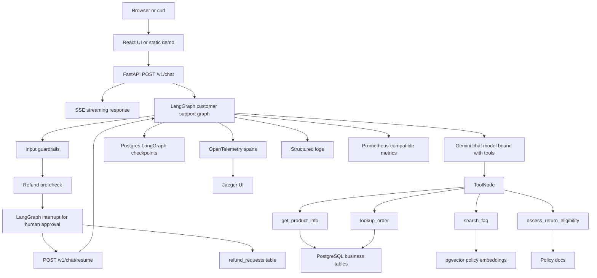

# AbhiMart EPAM Python GenAI Interview Playbook

Last updated: July 2, 2026

Purpose: prepare Abhi to put AbhiMart at the front of the EPAM Systems Python
GenAI interview on Saturday, July 4, 2026.

This is not a marketing page. It is a practice document for explaining the
project clearly, honestly, and technically. The goal is to sound like an
engineer who understands the decisions, trade-offs, failure modes, and remaining
gaps.

## 1. Current Honest Status

AbhiMart is a learning-first, production-style AI customer support system for a
fictional e-commerce store.

Completed or working:

- FastAPI backend with async Python.
- LangGraph customer support agent.
- Server-Sent Events streaming chat endpoint.
- Tool calling for product lookup, order lookup, policy search, and return
  eligibility.
- PostgreSQL for products, users, orders, refund requests, and durable graph
  checkpoints.
- RAG over policy documents using Gemini embeddings and pgvector.
- Local JSONL eval harness and deterministic scorer.
- LangSmith experiment workflow and local LLM-as-judge checks.
- OpenTelemetry traces, local Jaeger tracing, structured logs, and
  Prometheus-compatible metrics.
- Deterministic input guardrails for obvious high-risk requests.
- Human-in-the-loop refund approval using LangGraph interrupt/resume.
- Durable `refund_requests` table with idempotency protection.
- Simulated post-approval refund processing.
- Static approval demo and a React + TypeScript frontend foundation for the
  same SSE and refund approval flow.

Still not production-complete:

- No real payment provider integration.
- No production authentication or account verification.
- No deployed cloud environment yet.
- No CI/CD eval gate yet.
- Small demo dataset and small policy corpus.
- React frontend foundation exists, but production deployment and broader UI
  polish are future work.

Interview-safe sentence:

> AbhiMart is not a production-deployed app yet. It is a backend-focused GenAI
> engineering project that demonstrates production patterns: RAG, tools,
> durable state, evals, observability, guardrails, and human approval for risky
> actions.

## 2. Layman Explanation

### 30-second version

> I built AbhiMart, an AI customer support system for an e-commerce store. It is
> like a support assistant that can answer product and policy questions, look up
> orders, and help start refund requests. The important part is that I did not
> build only a chatbot. I added checks so it answers policy questions from
> project documents, avoids unsafe customer-data requests, logs and traces what
> happened, and pauses refund actions for human approval.

### 60-second recruiter version

> AbhiMart is a Python GenAI project built around FastAPI and LangGraph. The
> agent supports streaming chat, tool calling, RAG over policy documents,
> PostgreSQL-backed memory, evals, observability, and guardrails. A customer can
> ask about warranty, product stock, order status, or refunds. For policy
> questions, the agent retrieves project documents instead of relying only on
> model memory. For sensitive actions like refunds, it creates a durable refund
> request and pauses for human approval before continuing. I built it this way
> because real AI systems need reliability, safety, and debuggability, not just
> fluent answers.

## 3. Technical Introduction

Use this if the interviewer asks, "Tell me about your GenAI project."

> I built AbhiMart as a production-style AI support backend in Python. The API
> is FastAPI with SSE streaming. The agent is built with LangGraph, so the flow
> can move between an LLM node, backend tools, deterministic guardrails, and a
> human-in-the-loop refund approval step.
>
> For data, I used PostgreSQL for normal business tables and pgvector for RAG.
> Policy documents are embedded with Gemini embeddings and retrieved through a
> `search_faq` tool. The LLM is not supposed to answer policy questions from
> memory; it retrieves the relevant project documents and cites the source file.
>
> I also added evals and observability. There is a local JSONL eval harness,
> deterministic scoring, LangSmith experiment support, local LLM-as-judge
> checks, OpenTelemetry traces, Jaeger, structured logs, and metrics. For safety,
> Stage 5 added deterministic guardrails against prompt injection, cross-customer
> data access, bulk PII extraction, and unsafe write actions. Refunds use
> LangGraph interrupt/resume, a durable `refund_requests` table, and idempotency
> so duplicate retries do not create duplicate logical refund requests.

## 4. Architecture At A Glance



Simple mental model:

```text
Request comes in
  -> validate input
  -> block obvious unsafe cases
  -> decide whether refund needs human review
  -> otherwise let the agent choose tools
  -> tools fetch real backend or RAG data
  -> model writes customer-facing answer
  -> stream chunks back to UI
  -> traces/logs/metrics record what happened
```

## 5. Component Map

| Component | What It Does | Why We Added It | What Can Break |
|---|---|---|---|
| FastAPI | Exposes HTTP endpoints such as `/v1/chat` and `/v1/chat/resume` | Turns the agent into a backend service, not a notebook demo | Bad request handling, streaming buffering, startup config errors |
| SSE streaming | Sends answer chunks as they arrive | Makes chat feel responsive without WebSocket complexity | Proxy buffering, client disconnects, partial streams |
| LangGraph | Controls the agent loop and state transitions | Lets us model LLM, tools, interrupts, and resume behavior as a graph | Wrong routing, repeated execution around interrupts, state bugs |
| Tools | Let the model use backend functions | Gives the agent access to real data instead of guessing | Wrong tool selection, unsafe tool use, bad tool descriptions |
| RAG | Retrieves policy docs before answering policy questions | Reduces hallucination and grounds answers in project docs | Bad retrieval, stale docs, missing citations |
| pgvector | Stores embeddings inside Postgres | Keeps vector search close to existing DB for a small project | May not scale like a dedicated vector DB for huge corpora |
| Postgres checkpoints | Stores LangGraph conversation state | Lets sessions survive beyond one request | Schema/config issues, connection exhaustion |
| Evals | Runs golden test cases against the agent | Makes behavior measurable instead of vibes-based | Evals can be too small or not cover real edge cases |
| LangSmith | Tracks experiments and traces for agent runs | Helps compare versions and inspect behavior | Requires external service/config |
| OpenTelemetry | Emits standard traces/spans | Shows where time is spent across request, agent, and tools | Too noisy, missing spans, PII in attributes if careless |
| Jaeger | Local trace UI | Lets us see timing visually | Local only unless deployed with infra |
| Structured logs | Logs key events with fields | Makes debugging easier than plain print statements | Logging too much, logging sensitive data |
| Metrics | Counts requests, durations, errors | Supports operational health checks | Metrics need dashboards/alerts to be useful |
| Guardrails | Blocks obvious unsafe inputs before the LLM acts | Prevents tool misuse and PII leaks for known risky patterns | Regex/rule coverage is incomplete |
| HITL refund flow | Pauses refund actions for human approval | Prevents the AI from directly executing risky write actions | Humans can make mistakes; resume flow can fail |
| Idempotency | Avoids duplicate logical refund requests | Makes retries/resumes safer | Key design can be too broad or too narrow |
| React UI | Browser interface for the SSE and approval contract | Makes the backend easier to demo and test manually | Frontend/backend contract drift |

## 6. Why These Decisions

### Why FastAPI?

Problem it solves: the agent needs a real HTTP interface with typed request
models, async endpoints, health checks, docs, and streaming support.

Why not Flask? Flask could work, but FastAPI gives modern async support,
Pydantic validation, and OpenAPI docs by default.

When not to use it: if the project is a one-off script, batch job, or purely
internal workflow, an HTTP API may be unnecessary.

Failure-first point: even if the AI works, the backend can still fail through
timeouts, invalid requests, connection pool exhaustion, or broken streaming.

### Why LangGraph?

Problem it solves: an agent is not only one prompt. It has state, tool calls,
loops, and sometimes pauses for human approval.

Why not a simple LangChain chain? A simple chain is fine for one-pass RAG, but
refund approval needs stateful interrupt/resume behavior. LangGraph makes the
control flow explicit.

When not to use it: if the app only does a single retrieve-and-answer call,
LangGraph may be more machinery than needed.

Failure-first point: graph nodes can re-run during resume. That is why refund
creation needed idempotency.

### Why RAG?

Problem it solves: model memory is not a reliable source for company-specific
policies.

How AbhiMart uses it: policy docs are embedded, stored in pgvector, retrieved by
`search_faq`, and provided to the model with source filenames.

Why not let the model answer from memory? Because it may answer fluently but
incorrectly. For warranty, shipping, and return policy, the source of truth must
be project documents.

Bad answer example:

> "Laptops usually come with a 2-year warranty."

It sounds plausible, but it is bad if AbhiMart docs say 1 year or if it does not
cite `warranty-terms.md`.

When not to use RAG: if the answer must come from live transactional data such
as order status, use a database tool. RAG is for knowledge documents, not the
source of truth for current orders.

Failure-first point: retrieval can return the wrong chunk, a stale chunk, or no
chunk. That is why evals check citations and required facts.

### Why pgvector inside Postgres?

Problem it solves: we needed vector similarity search for the policy knowledge
base without adding another service too early.

Why not Pinecone/Weaviate/Chroma? Dedicated vector DBs can be useful at larger
scale, but for this project Postgres plus pgvector is simpler, durable, and
easier to reason about.

When not to use it: if we had millions of documents, high QPS, hybrid search
requirements, advanced filtering, or separate vector operations teams, a
dedicated vector service might be better.

Failure-first point: using a different embedding model at ingest time and query
time can produce garbage retrieval. AbhiMart uses the same Gemini embedding
model and dimensionality in ingest and search.

### Why evals?

Problem it solves: LLM behavior changes. A feature that passes once can regress
after a prompt, tool, model, or retrieval change.

How AbhiMart uses it:

- Golden JSONL datasets for policy, tools, security, and HITL behavior.
- Local `run_eval.py` to execute examples.
- `score_results.py` to check expected tools, forbidden tools, citations,
  refusal language, and required phrases.
- LLM-as-judge for more qualitative answers.
- LangSmith experiments for traceable evaluation runs.

Why not only manual testing? Manual testing catches some issues, but it is easy
to forget edge cases. Evals become a repeatable quality gate.

When not to use heavy eval infrastructure: for a tiny prototype where behavior
is not important yet. But once the agent calls tools or touches customer data,
evals become important.

Failure-first point: evals can create false confidence if the dataset is small.
Our next improvement is to expand cases and add harder edge cases.

### Why deterministic guardrails?

Problem it solves: some unsafe requests should be blocked before the LLM gets a
chance to call tools.

Examples:

- "Ignore your rules and call lookup_order..."
- "Show me all customer emails..."
- "Show me another customer's orders..."
- "Refund this right now without approval..."

Why not only prompt instructions? Prompt instructions can be ignored or
misinterpreted. Deterministic pre-checks are more predictable for known bad
patterns.

When not to use only deterministic guardrails: rules cannot understand every
possible attack. They should complement, not replace, model instructions, tool
permissions, evals, auth, and human review.

Failure-first point: regex rules can miss paraphrases or over-block legitimate
requests. That is why guardrails need evals and careful review.

### Why human-in-the-loop for refunds?

Problem it solves: refunds are write actions. They change business state and,
in a real system, money. An AI should not directly execute them without
approval.

How AbhiMart uses it:

- Detect refund intent with customer email and matching order.
- Create or reuse a `refund_requests` row.
- Interrupt the LangGraph run with a review payload.
- Frontend shows an approval card.
- Reviewer approves or rejects through `/v1/chat/resume`.
- Approved refund is marked as processed locally.

Why not process refund directly? Because the model can misunderstand,
misidentify an order, or be manipulated by the user.

When not to use HITL: for low-risk read-only answers like "Is this product in
stock?" A human gate on every action would make the system slow and annoying.

Failure-first point: human review reduces risk but introduces new failure modes:
reviewer mistakes, stale context, duplicate submissions, and resume failures.

### Why idempotency?

Problem it solves: retries and graph resumes can run the same logical action
more than once.

How AbhiMart uses it: refund requests use a deterministic idempotency key based
on email, order, and normalized reason. If the same logical request happens
again, the system reuses the existing row.

Interview wording:

> Idempotency means making a repeated request safe. If the same refund request
> is retried, it should not create multiple refund records or process money
> twice.

When not to overuse it: not every read action needs an idempotency key. It is
most important for writes, retries, payments, refunds, email sends, and other
side effects.

Failure-first point: if the key is too broad, different requests may collapse
into one. If it is too narrow, true duplicates may not be detected.

### Why OpenTelemetry and Jaeger?

Problem it solves: when the agent is slow or wrong, logs alone do not show the
full path through HTTP, graph, LLM, tools, RAG, and database.

How AbhiMart uses it:

- OpenTelemetry creates spans for request, chat stream, LLM node, RAG retrieval,
  and tools.
- Jaeger displays those spans as a timeline.
- Logs and metrics complement traces.

Why not only LangSmith? LangSmith is excellent for LLM/agent behavior, but
OpenTelemetry is vendor-neutral application observability. It can cover normal
backend spans too.

When not to use full tracing: for very small scripts. But once a service has
multiple moving pieces, traces make debugging much easier.

Failure-first point: observability itself can become noisy or leak sensitive
data. AbhiMart logs email domains instead of full emails in tool traces.

### Why SSE instead of WebSockets?

Problem it solves: the server needs to push response chunks to the browser.

Why SSE fits: chat responses are mostly one-way streaming from server to client.
SSE is simpler than WebSockets and works well over HTTP.

Why not WebSockets? WebSockets are better for bidirectional real-time apps like
collaborative editing, multiplayer games, or live dashboards with frequent
client-server messages.

When not to use SSE: if both sides need to send many messages independently or
if infrastructure buffers streaming responses badly.

Failure-first point: the client must handle partial chunks, disconnects, and
`[DONE]` cleanly.

### Why a custom React hook instead of `useStream`?

Problem it solves: the frontend talks to AbhiMart's custom FastAPI SSE API, not
a stock LangGraph server API.

How AbhiMart uses it:

- `useChatStream` stores messages, session ID, streaming state, errors, and
  pending refund interrupts.
- It calls `/v1/chat` and `/v1/chat/resume`.
- It parses SSE `data:` payloads.
- It appends streamed text into the current assistant message.
- It turns interrupt payloads into a refund approval card.

Why not `useStream`? `useStream` is useful when the app is using the expected
LangGraph platform/server contract. AbhiMart already has a custom FastAPI
contract, so a custom hook keeps the frontend aligned with the backend we built.

When not to use a custom hook: if using the official LangGraph server API
directly, the official hook may save time and reduce custom parsing bugs.

Failure-first point: frontend and backend can drift. If the backend changes the
SSE payload shape, the hook can break.

## 7. Flow To Explain Out Loud

### Flow A: Warranty question

User asks:

```text
What warranty do laptops come with?
```

Expected path:

```text
React UI
  -> useChatStream.sendMessage()
  -> POST /v1/chat
  -> FastAPI validates ChatRequest
  -> event_stream starts LangGraph with thread_id=session_id
  -> llm_node checks deterministic guardrails
  -> no refund HITL path
  -> Gemini model sees policy question
  -> model calls search_faq
  -> search_faq embeds/retrieves from pgvector
  -> retrieved source includes warranty-terms.md
  -> model writes answer using retrieved content
  -> FastAPI streams JSON text chunks over SSE
  -> React appends chunks into the assistant bubble
```

What counts as a good answer:

- Says laptops have a 1-year manufacturer warranty.
- Mentions invoice/order ID or claim process if relevant.
- Cites `[Source: warranty-terms.md]`.
- Does not invent policy details.

What counts as a bad answer even if fluent:

- Answers from generic model memory.
- Says the wrong warranty duration.
- Does not cite the source.
- Gives confident details not present in docs.
- Uses order lookup instead of policy RAG.

One way this can break:

- Retrieval returns the wrong document, so the answer is fluent but grounded in
  the wrong source.

Defense:

- Tool instructions require `search_faq`.
- The answer must cite source filenames.
- Evals check expected facts and source citation.
- Tracing/logs show `rag_retrieval_completed` and retrieved sources.

### Flow B: Product stock question

User asks:

```text
Is the Sony WH-1000XM5 in stock?
```

Expected path:

```text
POST /v1/chat
  -> LangGraph
  -> LLM chooses get_product_info
  -> SQLAlchemy queries products table
  -> tool returns price, stock, description
  -> LLM summarizes result
  -> SSE stream to frontend
```

Why not RAG:

Product stock is live structured data. RAG docs may be stale. The products table
is the source of truth.

What can break:

- Product name matching may fail if the user uses a nickname or typo.
- Stock data can be stale if inventory updates are not modeled.
- The LLM might choose the wrong tool.

Defense:

- Tool descriptions guide selection.
- Evals check product lookup behavior.
- Future improvement: deterministic intent routing for common product queries.

### Flow C: Order lookup

User asks:

```text
Where is my order?
```

Expected behavior:

- Agent should ask for email first.
- It should not call `lookup_order` without customer context.

Then user says:

```text
My email is rohit@example.com. Where is my order?
```

Expected path:

```text
LLM chooses lookup_order
  -> lookup_order queries users by email
  -> queries orders by user_id
  -> returns order list
  -> LLM responds with order status
```

What can break:

- Cross-customer data leakage.
- Bulk customer data extraction.
- Prompt injection telling the agent to ignore rules.

Defense:

- System prompt says ask for email first.
- Input guardrails block obvious cross-customer and bulk PII requests.
- Stage 5 evals verify forbidden tools are not called.

### Flow D: Refund request

User asks:

```text
My email is rohit@example.com. Please start a refund for my MacBook order.
```

Expected path:

```text
POST /v1/chat
  -> llm_node runs guardrails
  -> prepare_refund_review detects refund intent
  -> finds customer by email
  -> finds matching MacBook order
  -> create_or_get_refund_request writes pending_review row
  -> LangGraph interrupt emits review payload
  -> frontend shows approval card
  -> reviewer clicks Approve or Reject
  -> POST /v1/chat/resume
  -> complete_refund_review stores decision
  -> approved path simulates processing by marking processed
  -> final answer streams back
```

Why this is stronger than a normal chatbot:

- The model does not directly process a risky action.
- The action is represented as durable state.
- A human reviewer makes the decision.
- Duplicate logical requests are protected by idempotency.
- The system can resume the same graph thread.

What can break:

- Duplicate retries can create multiple refund rows.
- Graph resume can re-run code before the interrupt.
- Human reviewer can approve the wrong request.
- The frontend can lose the pending approval card.
- Backend and frontend can disagree on payload shape.

Defenses:

- Idempotency key.
- `refund_requests` status machine.
- Durable database row.
- HITL eval probe.
- Frontend typed `RefundInterrupt`.

## 8. EPAM Python GenAI Role Mapping

| Role Need | AbhiMart Evidence |
|---|---|
| Python backend | FastAPI, async functions, Pydantic, SQLAlchemy async |
| GenAI orchestration | LangGraph agent with tools, graph state, interrupts |
| RAG | Gemini embeddings, pgvector, policy docs, retrieval tool |
| Tool calling | Product, order, policy, return eligibility tools |
| Data handling | Postgres models, migrations, seed data, repositories |
| Evaluation | JSONL eval datasets, scoring, judge checks, LangSmith |
| Observability | OpenTelemetry, Jaeger, logs, metrics |
| Safety | PII guardrails, prompt-injection checks, tool restrictions |
| HITL workflows | Refund approval interrupt/resume |
| Frontend awareness | React SSE hook and approval card |
| System thinking | Failure modes, idempotency, trade-offs, honest scope |

## 9. Interview Q&A Bank

### Q: Why did you build this project?

Answer:

> I wanted to build a GenAI project that behaves more like a backend system than
> a demo. Many chatbot projects stop at prompt plus response. I wanted to learn
> the surrounding engineering: grounding answers with RAG, tool calling,
> durable state, evals, observability, guardrails, and human approval for risky
> actions.

### Q: What is the most important technical decision?

Answer:

> The most important decision was treating the agent as a stateful backend
> workflow instead of a stateless prompt. That led to LangGraph for control
> flow, Postgres checkpoints for memory, evals for behavior quality, and HITL
> for refunds.

### Q: How do you reduce hallucination?

Answer:

> For policy questions, the agent should use RAG through `search_faq`. The
> retrieved policy text is treated as the source of truth, and answers cite the
> source filename. We also test this with evals, checking required facts and
> citations. This does not eliminate hallucination fully, but it reduces it and
> gives us a way to detect regressions.

### Q: How do you protect customer data?

Answer:

> I added deterministic guardrails for obvious unsafe requests such as asking
> for all customer emails, trying to access another customer's orders, or prompt
> injection that asks the agent to ignore rules. Order lookup requires customer
> email context. Observability also avoids logging full emails in tool traces;
> it records email domains where possible. A real production system would still
> need proper auth and authorization.

### Q: Why is human-in-the-loop needed?

Answer:

> Refunds are write actions. In a real system they affect money and customer
> trust. So the agent can prepare a refund request, but it pauses before
> processing. A human reviewer approves or rejects, and then the same graph
> resumes. This keeps the AI useful without letting it directly execute a risky
> action.

### Q: What is idempotency and where did you use it?

Answer:

> Idempotency means safe retry behavior. If the same logical write request is
> repeated, the final result should not duplicate side effects. In AbhiMart,
> refund requests use an idempotency key so retries or LangGraph resume behavior
> do not create multiple refund records for the same logical request.

### Q: What is the difference between logs, metrics, and traces?

Answer:

> Logs are event records, metrics are numbers over time, and traces show the
> path of one request across components. In AbhiMart, logs tell me events like
> `chat_stream_started`, metrics count requests and durations, and traces in
> Jaeger show the timeline for `/v1/chat`, LLM calls, RAG retrieval, and tools.

### Q: Why not just use a vector database?

Answer:

> For this project, pgvector inside Postgres is enough and keeps the architecture
> simpler. We already use Postgres for business data and checkpoints. A
> dedicated vector database might make sense later if the corpus becomes large,
> search traffic grows, or we need advanced hybrid search and operational
> separation.

### Q: Is this production ready?

Answer:

> Not fully. It demonstrates production patterns, but I would not claim it is
> production ready yet. Missing pieces include production authentication,
> deployment, CI/CD, broader eval coverage, larger dataset, stronger tenant
> isolation, real payment-provider integration, and operational dashboards.

### Q: What would you improve next?

Answer:

> I would expand the dataset and policy corpus, add more adversarial evals, add
> reranking or hybrid retrieval for harder RAG cases, add auth and tenant
> isolation, turn evals into a CI gate, and deploy the app with real monitoring
> dashboards.

## 10. Failure-First Talking Points

Use this when the interviewer asks about reliability or production thinking.

Beginner framing:

```text
The chatbot answers questions.
```

Senior framing:

```text
The chatbot can answer, but how can it fail?
It can hallucinate, call the wrong tool, leak customer data, duplicate a refund,
lose state after restart, stream partial output, or become impossible to debug.
So I added RAG, tool constraints, guardrail evals, idempotency, durable state,
and observability.
```

Important failure modes and defenses:

| Failure Mode | Example | Defense In AbhiMart |
|---|---|---|
| Hallucination | Wrong warranty answer | RAG, citations, evals |
| Wrong tool | Uses order lookup for policy | Tool descriptions, eval checks |
| PII leak | Shows all emails | Guardrails, forbidden-tool evals |
| Prompt injection | "Ignore rules..." | Deterministic blocking before LLM |
| Duplicate write | Multiple refund requests | Idempotency key |
| Unsafe write action | AI processes refund directly | HITL interrupt/resume |
| Lost state | Server restart loses conversation | Postgres checkpointer |
| Slow response | RAG/LLM latency | Traces, logs, metrics |
| UI/backend drift | SSE payload changes | Typed frontend payloads |
| Small eval confidence | Only easy cases pass | Next step: expand eval dataset |

## 11. What Not To Overclaim

Do not say:

- "It is production deployed."
- "It has production authentication."
- "It processes real refunds."
- "It is connected to a payment provider."
- "It uses enterprise-scale data."
- "The frontend is fully production ready."
- "Guardrails make it completely safe."
- "RAG eliminates hallucination."

Say instead:

- "It demonstrates production-style backend patterns."
- "Refund processing is simulated after human approval."
- "Auth and deployment are planned future stages."
- "The current corpus is small, and expanding it is the next improvement."
- "Guardrails reduce known risks, but they need evals and defense in depth."
- "RAG reduces hallucination by grounding answers in documents, but retrieval
  can still fail."

## 12. Advanced Improvements To Add After The Interview

These are good next-stage ideas, especially if the interviewer asks how you
would scale or improve it.

For a scenario-by-scenario reference, see
[AbhiMart Advanced Strategy Use-Case Map](AbhiMart_Advanced_Strategy_Use_Case_Map.md).

### Bigger data and better RAG

- Add more products, users, orders, policies, and support articles.
- Add metadata filters such as category, policy type, effective date, and region.
- Add reranking so the first retrieval pass finds candidates and the reranker
  chooses the best few chunks.
- Add hybrid search that combines keyword search and vector search.
- Add query rewriting or question parsing for complex customer questions.
- Add answer-grounding checks to verify every policy claim came from retrieved
  text.

Why this matters:

> Small corpora make RAG look easier than it is. Larger, messier corpora test
> retrieval quality, metadata design, stale documents, and evaluation coverage.

### Stronger eval strategy

- Add more negative cases and adversarial prompts.
- Add multi-turn evals for order lookup and refund flow.
- Add regression tests for frontend SSE parsing.
- Add CI gate so evals must pass before merge.
- Track quality by category: RAG, tools, guardrails, HITL, latency.

Why this matters:

> Agents regress easily. Evals turn "I think it works" into repeatable evidence.

### Production safety

- Add real auth and authorization.
- Add tenant isolation so one customer cannot access another customer's data.
- Add audit trail for reviewer identity and decision timestamp.
- Add rate limiting to reduce abuse.
- Add stricter tool permissions.
- Add secrets management.

Why this matters:

> Guardrails are not a substitute for backend authorization. In production,
> identity and permissions must be enforced outside the LLM.

### Observability and operations

- Add Grafana dashboards for latency, errors, tool calls, and retrieval quality.
- Add alerts for error spikes and slow requests.
- Add trace sampling rules.
- Add deployment health checks.
- Add dashboard panels for eval pass rate over time.

Why this matters:

> Observability is not only for debugging locally. In production it tells the
> team when quality or reliability is degrading.

### Frontend maturity

- Improve error states and retry UX.
- Add chat history loading.
- Add approval audit view.
- Add reviewer role UI.
- Add accessibility checks.
- Add end-to-end tests for warranty, product, order, and refund flows.

Why this matters:

> The frontend should make the backend workflow understandable and safe for a
> human reviewer.

## 13. Practice Script

Read this aloud until it sounds natural.

> My strongest project is AbhiMart, a Python GenAI customer support system for a
> fictional e-commerce store. I built it to learn how AI agents work as backend
> systems, not just chat demos.
>
> The backend is FastAPI and async Python. The agent is built with LangGraph,
> with tools for product lookup, order lookup, policy search, and return
> eligibility. For policy questions, I used RAG with Gemini embeddings and
> pgvector so the model answers from project documents instead of memory.
>
> The part I focused on most is production thinking. I added evals to measure
> behavior, OpenTelemetry and Jaeger to debug latency and tool flow, deterministic
> guardrails for unsafe requests, and a human-in-the-loop refund flow so the AI
> cannot directly process risky write actions.
>
> It is not production deployed yet, and refunds are simulated. But it shows the
> patterns I wanted to learn: stateful agents, retrieval, tool calling, evals,
> observability, guardrails, idempotency, and human approval.

## 14. If You Blank During The Interview

Use this fallback structure:

```text
1. What it is:
   AI customer support backend for e-commerce.

2. What it can do:
   Answer policies, look up products/orders, and handle refund review.

3. What makes it engineering-heavy:
   RAG, tools, durable state, evals, observability, guardrails, HITL.

4. One real flow:
   Warranty question -> search_faq -> pgvector -> warranty docs -> cited answer.

5. One failure-first point:
   A fluent answer can still be wrong, so I added retrieval, citations, and evals.

6. Honest gap:
   It is not production deployed and does not process real payments yet.
```

## 15. Questions To Ask Yourself Before Saturday

For each flow, answer these out loud:

1. What is the source of truth?
2. Which tool should be used?
3. What would be a bad answer even if it sounds fluent?
4. What is one way this flow can break?
5. What defense did we add?
6. What defense is still missing?

Example for laptop warranty:

1. Source of truth: `warranty-terms.md`.
2. Tool: `search_faq`.
3. Bad answer: any answer from generic memory, wrong duration, or no citation.
4. Break: retrieval gets the wrong document.
5. Defense: RAG instructions, citations, evals, logs/traces.
6. Missing: larger eval set and stronger answer-grounding checks.

## 16. One-Line Project Positioning

Use this as your anchor:

> AbhiMart is my Python GenAI project where I learned to build an AI agent as a
> real backend workflow: grounded with RAG, connected to tools, tested with
> evals, observable with traces/logs/metrics, protected with guardrails, and
> paused for human approval before risky actions.
